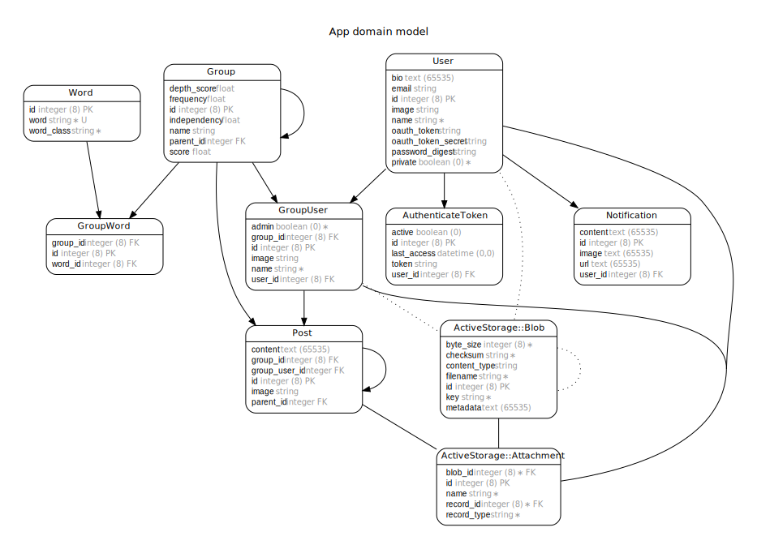

# COJT SNS Sever

COJT SNS Project バックエンド部分のリポジトリです。

## 導入

以下のソフトウェアが必要です

- Windows10 pro
- Docker for Windows

参考  
[Docker for Windows 導入](https://qiita.com/fkooo/items/d2fddef9091b906675ca)

> Hint: Docker の Setting>Resources>File Sharing にソースがあるドライブを追加しましょう

リポジトリクローンして、

```
cp .env .env.dev
docker-compose build
```

## ローカル環境起動

API/DB サーバーを以下で起動させる

```
docker-compose up
```

以下で 200 が返ることを確認

```
curl http://localhost:4000/health_check
```

## 開発 Tips

Rails 関連のコマンドを打つとき

```
docker-compose run api <Rails コマンド>
```

特に、db 初期化&初期データ追加

```
docker-compose run api rake db:migrate:reset db:seed
```

master を pull したとき

```
docker-compose run api bundle install
```

コード整形(Rubocop)

```
docker-compose run api rubocop --auto-correct
```

ER 図作成

```
docker-compose run api bundle exec erd --filetype=svg --attributes=content,primary_keys,foreign_keys --filename=docs/db
```

## DB 設計


